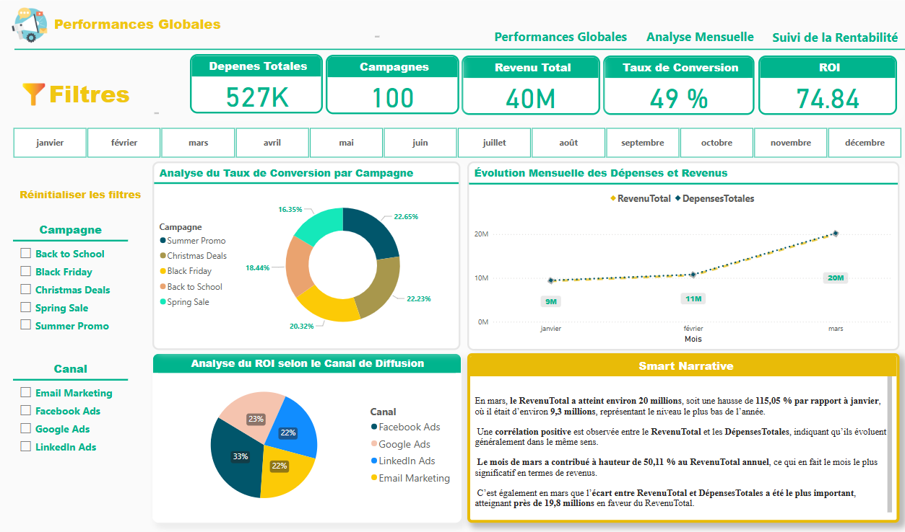
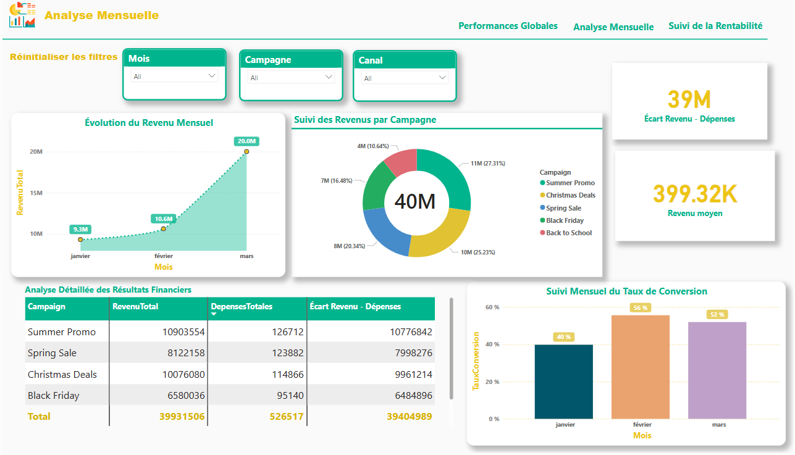
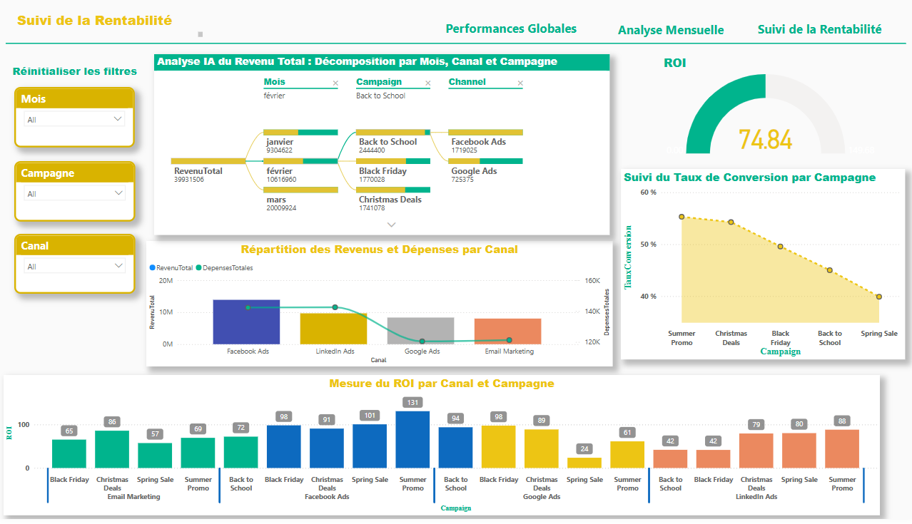

# 📊 Analyse Stratégique des Campagnes Marketing

Ce projet présente un tableau de bord dynamique réalisé avec **Power BI**, conçu pour analyser les performances de campagnes marketing multicanal :  
📩 Emailing | 📱 Facebook Ads | 🔍 Google Ads

---

## 🎯 Objectifs

- Fournir une vue consolidée des actions marketing
- Suivre les KPI clés : impressions, clics, conversions, CPC, ROI
- Identifier les canaux les plus performants
- Optimiser la prise de décision et les budgets

---

## 🧰 Méthodologie

- **Excel** : structuration initiale des sources de données  
- **Power Query** : transformation et modélisation des données  
- **DAX** : création de mesures personnalisées  
- **Power BI** : conception du tableau de bord interactif  

---

## 📊 Pages du tableau de bord

### 1. Performance Globale  
Vue d’ensemble des résultats tous canaux confondus  


---

### 2. Analyse Mensuelle  
Comparaison des indicateurs par mois  


---

### 3. Suivi de Rentabilité  
Analyse du ROI, du coût par clic et de l'efficacité budgétaire  


---

## ✅ Résultat

Un tableau de bord automatisé, clair et prêt à l’emploi, permettant aux équipes marketing de mieux piloter leurs actions et d’optimiser la rentabilité des campagnes.

---

## 🚀 Installation

1. Clonez le dépôt :
   ```bash
   git clone https://github.com/ton-nom-utilisateur/Analyse-Strat-gique-des-Campagnes-Marketing.git
